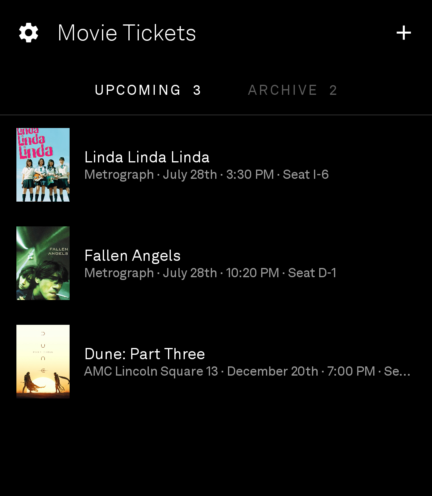
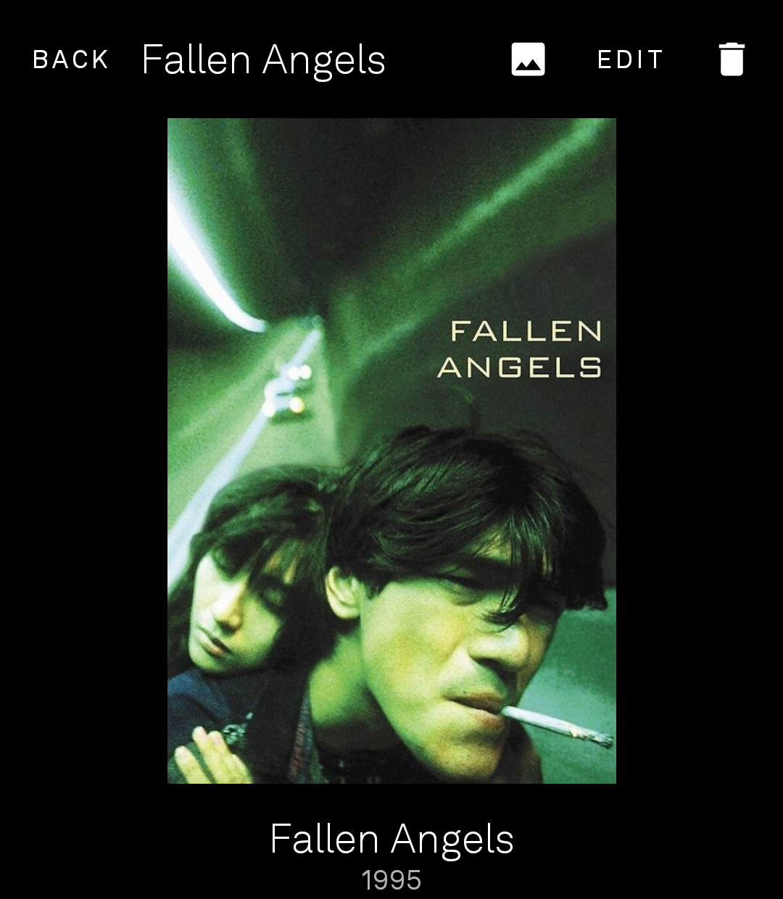
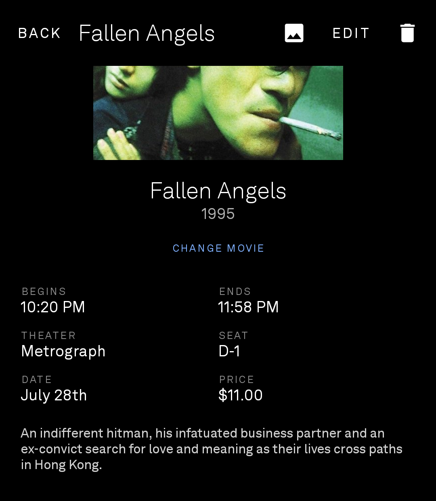

# LightPass

Movie ticket stubs on the Light Phone III. Photograph a stub, and LightPass reads the
title, theater, date, time, seat and price off the paper. The ticket then lives in a
local collection sorted by showtime, and moves to an archive after the film ends.

LightOS shows the tool as **Movie Tickets**.

Part of the [gi-os Light App collection](#the-gi-os-light-app-collection).

## What it does

- Capture a stub with the camera, or import a photo from the album.
- Claude Haiku reads the photo and returns the ticket fields, a confidence score, and a
  bounding box. LightPass crops the stub to that box and keeps the full photo behind a
  zoomable viewer.
- TMDb supplies the poster. A search list lets you correct the film if the parser picks
  the wrong one.
- Every field stays editable. **SAVE** in the top bar writes the change.
- Tickets sort by showtime. Dates read as "August 6th". Theater names use title case.
- The detail page turns off the phone grayscale filter while a stub is open, so the
  ticket shows in color. The phone returns to grayscale when you close the page.
- Room stores the collection on the device. There is no account and no server.

## The wheel

Turning the phone's wheel scrolls the ticket list, the detail page, the edit fields and the
film search results. On the ticket photo it pans the image once you have pinched in, which is
the only comfortable way to read the small print at the bottom of a stub.

The wheel arrives as ordinary key events, because LightOS relabels an optical sensor's
scancodes as `WHEEL_CCW` and `WHEEL_CW`. The activity claims them in `dispatchKeyEvent`,
ahead of the view hierarchy, so a focused title field cannot swallow them. Notches arrive
faster than a frame, so each one becomes a debt that a share of gets paid off per frame, and
the first notch after a pause is held back because the wheel sits under a thumb. The page
under the open ticket photo stands down while the photo is up.

None of that needs anything else installed. There is no service, no permission and no root
behind it. Light patched `/system/usr/keylayout/Generic.kl`, so a notch reaches whichever app
holds focus as an ordinary key event, and LightPass handles it itself. The long version is in
[LightNews](https://github.com/gi-os/LightNews#the-wheel-and-the-camera-button).

The wheel *click* and the camera button are left alone, and
[LightControl](https://github.com/gi-os/LightControl) is the optional app that picks them up.
It adds brightness on hold-and-turn, the flashlight on a tap, and the camera on the camera
button. Every one of those is rebindable, tap and hold apart, to any app on the phone. Apps
with no wheel code of their own get brightness or a synthetic-swipe scroll from it as well.

Installing it does not take scrolling away from LightPass. It passes bare turns through to
`com.gios.*`, `com.lightfastread` and `com.lightrss.reader` deliberately, so the ticket list
keeps its own per-notch scroll.

```bash
# Optional: LightControl, for brightness, the flashlight and the camera button
adb install -r LightControl-v1.0.x.apk

# The key service. NOTE: this setting is a list, and this command REPLACES it —
# if you also run LightVoice's push-to-talk, colon-join both components instead.
adb shell settings put secure enabled_accessibility_services \
  com.gios.lightcontrol/com.gios.lightcontrol.keys.ControlService
adb shell settings put secure accessibility_enabled 1

# Brightness, and the level readout + opening apps from the service
adb shell appops set com.gios.lightcontrol WRITE_SETTINGS allow
adb shell appops set com.gios.lightcontrol SYSTEM_ALERT_WINDOW allow
```

The latest build is at <https://github.com/gi-os/LightControl/releases/latest>.

## Keys

LightPass needs an Anthropic API key to parse a stub. A TMDb key is optional and only
adds posters. Enter both in Settings, or scan them.

The scanner accepts a prefixed payload in a QR code, which saves you from typing a long
key on the phone keyboard. [docs/index.html](docs/index.html) builds those codes in the
browser and sends nothing anywhere.

## Install

Every push to `main` builds an APK and attaches it to a GitHub Release.

1. Install [Obtainium](https://github.com/ImranR98/Obtainium).
2. Add `https://github.com/gi-os/LightPass` as an app. Obtainium then tracks the
   releases.

To sideload by hand, download the APK from
[Releases](https://github.com/gi-os/LightPass/releases/latest) and run:

```sh
adb install -r LightPass-vX.Y.Z.apk
```

Grant the color permission once. Without it the stubs stay gray and nothing else
changes.

```sh
adb shell pm grant com.gios.lightpass android.permission.WRITE_SECURE_SETTINGS
```

## Build

```sh
./gradlew :app:assembleDebug
```

You need JDK 17 and the Android SDK. `compileSdk` is 35 and `minSdk` is 29. The repo
commits a debug keystore so that every build carries the same signature and Obtainium
can update in place.

## A note on the SDK

LightPass is a plain Android app. It does not use
[light-sdk](https://github.com/lightphone/light-sdk). That choice buys CameraX, the
normal soft keyboard, and no API allowlist. The cost is that LightPass cannot enter the
official Tool Library until someone ports it into the SDK `tool` module. Install it
through Developer Mode with tool permissions set to **Any tools**.

`LightFont.kt` reads Akkurat off the device font list, so the app matches the LightOS
type without a bundled font file.

## Screenshots

<table>
  <tr>
    <td align="center">
      <br>
      <sub>Upcoming and archive</sub>
    </td>
    <td align="center">
      <br>
      <sub>Every field editable</sub>
    </td>
    <td align="center">
      <br>
      <sub>Poster in full color</sub>
    </td>
  </tr>
</table>

Taken on a Light Phone III. The posters show color because the detail page turns off the
system grayscale filter while a stub is open.

## Origin and credits

- **[gi-os/NDPass](https://github.com/gi-os/NDPass)** is the iOS ticket collector this
  app grew out of. LightPass reuses its ticket schema (title, theater, date, time, seat,
  price, confidence) and its detail-page layout.
- **[vandamd](https://github.com/vandamd)** is where I saw the grayscale trick, in
  [zero](https://github.com/vandamd/zero) (MIT). The Light Phone grayscale is the stock
  Android color-correction setting, and an app with `WRITE_SECURE_SETTINGS` can turn it
  off. `util/Grayscale.kt` is a separate 30-line implementation of that idea against
  `Settings.Secure`, applied to a ticket viewer.
  [garado/light-topographic](https://github.com/garado/light-topographic) ships the same
  technique as a native module. Thank you both.
- **[The Light Phone](https://www.thelightphone.com/)** for the hardware, for LightOS,
  and for opening the SDK to the community.
- **[Anthropic](https://www.anthropic.com/)** for the Claude API that reads the stubs.
  **[TMDb](https://www.themoviedb.org/)** for the poster data. This product uses the
  TMDb API but TMDb does not endorse or certify it.
- CameraX, Jetpack Compose, Room, and OkHttp do the rest.

LightPass came first in this collection, so several later tools took code from it.
[LightQR](https://github.com/gi-os/LightQR) started as the QR key scanner on this
screen. [LightRSS](https://github.com/gi-os/LightRSS) rewrote its own scanner around the
`LifecycleCameraController` and the direct `checkSelfPermission` gate that LightPass
uses, because the SDK scanner would not start reliably in a release build.

## The gi-os Light App collection

Twelve tools for the Light Phone III, all open source, all built in one run.

| Tool | What it does | Built on |
| --- | --- | --- |
| **LightPass** (this repo) | Photograph a movie ticket, keep the stub | Plain Android |
| [LightQR](https://github.com/gi-os/LightQR) | QR scanner, plus a browser generator | Plain Android |
| [LightRSS](https://github.com/gi-os/LightRSS) | RSS and Atom reader with images and QR subscribe | light-sdk, fork of [zachattack323/LightRSS](https://github.com/zachattack323/LightRSS) |
| [LightNYCSubway](https://github.com/gi-os/LightNYCSubway) | Live MTA subway arrivals | light-sdk fork |
| [chat](https://github.com/gi-os/chat) | iMessage over a self-hosted BlueBubbles server | Fork of [craigeley/chat](https://github.com/craigeley/chat) |
| [LightFog](https://github.com/gi-os/LightFog) | Fog of World companion, GPS recorder and fog map | Fork of [garado/light-topographic](https://github.com/garado/light-topographic) |
| [LightNonogram](https://github.com/gi-os/LightNonogram) | Picross, plus a generator that only ships solvable puzzles | Kotlin generator, light-sdk tool |
| [LightSolitaire](https://github.com/gi-os/LightSolitaire) | Klondike, draw one, unlimited redeals | light-sdk |
| [LightFastread](https://github.com/gi-os/LightFastread) | RSVP speed reader for EPUB and MOBI | Fork of [fluffyspace/FastRead](https://github.com/fluffyspace/FastRead) |
| [LightTip](https://github.com/gi-os/LightTip) | Tip calculator, plus a receipt splitter that reads the line items | Plain Android |
| [LightNoise](https://github.com/gi-os/LightNoise) | Twelve synthesized sounds, a two-layer mixer and a sleep timer | Plain Android |
| [LightPods](https://github.com/gi-os/LightPods) | AirPods battery, in-ear and lid status | Plain Android, ports [LibrePods](https://github.com/kavishdevar/librepods) |

The Light Phone does not sponsor or endorse any of these. Licences vary per repo.

## License

MIT. See [LICENSE](LICENSE).
